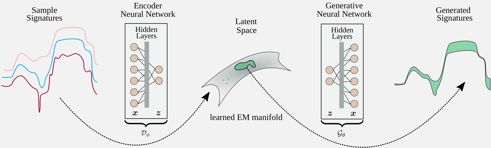

#  Deep Generative Endmember Modeling: An Application to Unsupervised Spectral Unmixing    #

This package contains the authors' implementation of the paper [1].

In order to address endmember variability in spectral unmixing, the endmember spectra are modelled using a deep generative model (a VAE), which is learned from the observed hyperspectral image. This allows us to parametrize the variable endmembers using points in the low-dimensional latent space of the generative models, which can then be simultaneously optimized with the abundances to solve the unmixing problem.

The code is implemented in MATLAB and includes:  
-  example1.m                - a demo script comparing the algorithms (DC1)  
-  example2.m                - a demo script comparing the algorithms (DC2)  
-  example3.m                - a demo script comparing the algorithms (DC3)  
-  example4.m                - a demo script comparing the algorithms (DC4)  
-  example_real1.m           - a demo script comparing the algorithms (Houston)  
-  example_real2.m           - a demo script comparing the algorithms (Samson)  
-  example_real3.m           - a demo script comparing the algorithms (Jasper Ridge)  
-  ./DeepGUn/                - contains the MATLAB files associated with the DeepGUn algorithm
-  ./python/                 - contains the Python files associated with the DeepGUn algorithm
-  ./other_methods/          - contains the ELMM, GLMM and PLMM methods
-  ./utils/                  - useful functions
-  ./data/                   - images used in the examples
-  README                    - this file  

## IMPORTANT:
If you use this software please cite the following in any resulting
publication:

    [1] Deep Generative Endmember Modeling: An Application to Unsupervised Spectral Unmixing
        R.A. Borsoi, T. Imbiriba, J.C.M. Bermudez.
        IEEE Transactions on Computational Imaging, 2019.

## INSTALLING & RUNNING:
Just start MATLAB and run one of the demo scripts (e.g. example1.m, example2.m, etc).

### Requirements
The variational autoencoders are trained in Python using the Keras package. 

## NOTES:
1.  The ELMM algorithm was provided by Lucas Drumetz.  
    Drumetz, L., Veganzones, M.-A., Henrot, S., Phlypo, R., Chanussot, J., & Jutten, C.
    Blind hyperspectral unmixing using an extended linearmixing model to address spectral variability.
    IEEE Transactions on Image Processing, 2016.

2.  The GLMM algorithm was provided by Tales Imbiriba at https://github.com/talesimbiriba/GLMM.  
    Imbiriba, T., Borsoi, R.A. & Bermudez J.C.M.
    Generalized linear mixing model accounting for endmember variability.
    IEEE International Conference on Acoustics, Speech and Signal Processing (ICASSP), 2018.

3.  The PLMM algorithm was provided by Pierre-Antoine Thouvenin.  
    Thouvenin, P.-A., Dobigeon, N., & Tourneret, J.-Y.
    Hyperspectral unmixing with spectral variability using a perturbed linear mixing model.
    IEEE Transactions on Signal Processing, 2016.

3.  The minFunc optimization toolbox was provided by Mark Schmidt and can be found at  
    http://www.cs.ubc.ca/~schmidtm/Software/minFunc.html

